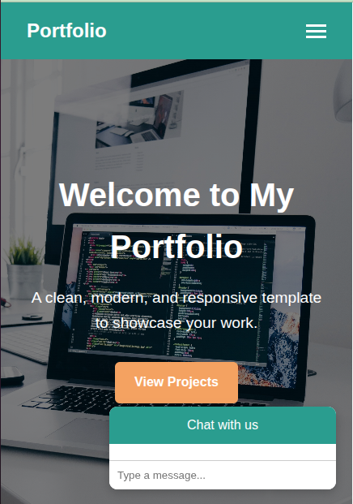

## 🚀 Portfolio Website Template

A professional and responsive portfolio template built with HTML, CSS, and JavaScript.
Designed for developers, freelancers, and creatives to showcase their skills, services, and projects with a clean modern layout.
## ✨ Features

Modern, minimal, and professional design

Responsive layout (desktop, tablet, and mobile)

Hero section with call-to-action

About section for bio/intro

Services section to highlight offerings

Projects showcase with links

Contact form for client inquiries

Chatbot widget for simple interactivity

Sticky navigation with mobile-friendly menu
## portfolio-template/
│
├── index.html      # Main HTML file
├── style.css       # Stylesheet
├── script.js       # JavaScript (menu + chatbot)
├── images/         # Placeholder images & screenshots
├── README.md       # Documentation
└── LICENSE         # MIT License
1. write code in Vscode
2. Open in Browser

Open index.html in your preferred browser.

3. Customize

Replace placeholder text (Your Name, Your Email, etc.)

Add your own projects in the Projects Section

Update chatbot messages in script.js

Add your social or external links in the footer

## Technologies Used

HTML5 – structure

CSS3 – styling & layout

JavaScript (ES6) – interactivity (menu + chatbot)

##  Screenshots

### Home Page

### Projects Section

### Contact Form + Chatbot

## responsive to all screens

## services

# live demo 

## 📜 License  
This project is licensed under the **MIT License**.  

  

 – free to use and modify.